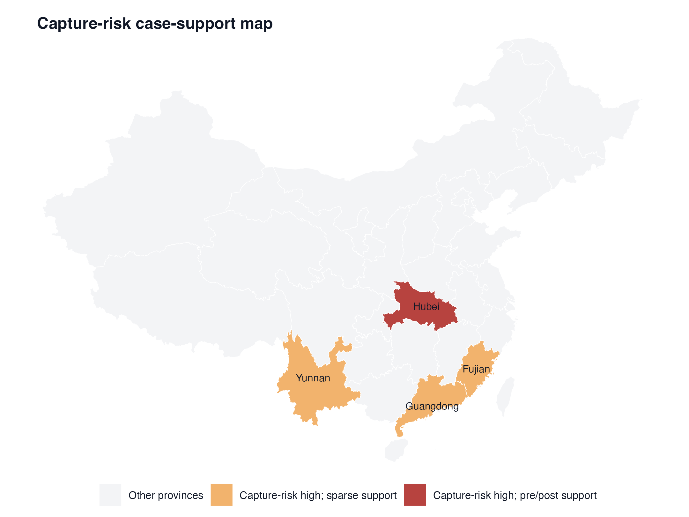

# EPVR Benefit-Sharing Replication Package

<p align="center">
  
  
  
  
</p>

This repository contains replication code and analysis for the paper:

> Anonymous (2026). "Benefit-Sharing Institutions in China's Ecosystem Product Value Realization Markets: A Diagnostic Framework and Distributional Evidence." *Land Use Policy* (under review).

We develop a **Benefit-Sharing Institution Index (BSI)** from 168 EPVR policy cases, construct a province-year panel (2015-2024), and estimate distributional effects using staggered difference-in-differences.

## Intuition

<p align="center">
  
</p>

The capture-risk analysis relies on uneven provincial case support. Hubei has pre/post support for capture-risk comparisons, while Yunnan, Guangdong, and Fujian provide sparse support cases. The map makes the empirical support structure visible before the DID and robustness exercises.

## Highlights

- Benefit-Sharing Institution Index built from 168 EPVR policy cases and 12 indicators.
- Triple-source BSI coding pipeline: rule-based coding, LLM-assisted coding, and automated cross-validation.
- Province-year panel construction from government bulletins and supporting remote-sensing/panel data.
- Staggered DID, event-study, matching DID, mechanism regressions, and robustness checks.
- Publication table and figure generation for Land Use Policy-style replication artifacts.

## API Requirements

Short answer: **the main empirical replication does not require model API keys**.

Use the companion processed data package if you only want to reproduce the province-year panel, DID tables, robustness checks, and publication figures. The scripts under `src/empirical/` run on local CSV inputs and do not call external model APIs.

APIs are needed only for optional reconstruction steps:

- **Primary model API**: required only if you rerun `src/bsi_coding/llm_assisted_coding.py` with `--phase primary` or `--phase both`. Set `LLM_API_KEY`; optionally set `LLM_BASE_URL` and `LLM_MODEL`.
- **Secondary model proxy**: optional second-pass coding path. Set `SECONDARY_LLM_PROXY_URL` and `SECONDARY_LLM_MODELS` only if you run a compatible local proxy and choose `--phase secondary` or `--phase both`.
- **Search API**: only relevant for the government search crawlers, such as `src/crawler/crawl_gov_search.py` and `src/crawler/crawl_gov_search_more.py`. Set `SEARCH_API_KEY` if you run those crawlers. If you start from the companion raw/processed data, skip these crawlers.

The deterministic rule-based BSI coder, panel construction, and empirical estimators do not require model API keys. The model-client Python packages are listed in `requirements.txt` because the repository includes the optional LLM-assisted coding workflow.

## Repository Structure

```text
.
|-- README.md
|-- requirements.txt
|-- src/
|   |-- crawler/                 # Web crawling and document collection
|   |-- bsi_coding/              # BSI coding pipeline
|   |-- panel/                   # Province-year panel construction
|   `-- empirical/               # DID estimation and robustness
|-- analysis/
|   |-- tables/                  # Output tables
|   `-- figures/                 # Publication figures
|       `-- figure2_capture_support_map.png
|-- docs/                        # Coding protocol, data dictionary, identification notes
`-- paper/                       # Manuscript artifacts
```

## Requirements

```bash
git clone git@github.com:Hik289/agricultural-economics.git
cd agricultural-economics

python -m venv .venv
source .venv/bin/activate
pip install -r requirements.txt
```

Key packages include `pandas`, `numpy`, `statsmodels`, `linearmodels`, `pyfixest`, `csdid`, `requests`, `beautifulsoup4`, and optional model-client libraries.

## Replication Steps

For most replication use cases, start from the companion data package and run Step 3 and Step 4. Steps 1 and 2 rebuild the dataset and coding pipeline from raw documents; those are optional and may require web access or LLM calls depending on how far you rebuild.

### 1. Data Collection

Crawl EPVR policy documents from Chinese government portals:

```bash
python src/crawler/crawl_seed_pages.py
python src/crawler/crawl_gov_search.py
python src/crawler/download_pdfs.py
python src/crawler/parse_html_pdf.py
```

Expected outputs include `data/cases_raw.csv`, `data/raw_html/`, and `data/raw_pdf/`.

### 2. BSI Coding

Run the deterministic rule-based coder:

```bash
python src/bsi_coding/code_bsi_rules.py
```

Optional LLM-assisted coding requires API/proxy setup:

```bash
export LLM_API_KEY="your-api-key"
export LLM_BASE_URL="https://your-compatible-endpoint/v1"
export LLM_MODEL="your-model-name"
python src/bsi_coding/llm_assisted_coding.py --phase primary

# Optional only if a compatible secondary proxy is running:
export SECONDARY_LLM_PROXY_URL="https://your-secondary-proxy/v1/messages"
export SECONDARY_LLM_MODELS="model-a,model-b"
python src/bsi_coding/llm_assisted_coding.py --phase secondary
python src/bsi_coding/llm_assisted_coding.py --phase merge
```

The automated validation pipeline expects the rule-coded and, when used, LLM-coded files:

```bash
python src/bsi_coding/auto_validation_pipeline.py
```

Expected final output: `data/processed/cases_bsi.csv` with 168 cases and 12 BSI indicators.

### 3. Panel Construction

Build the province-year panel from NBS bulletins:

```bash
python src/panel/crawl_province_bulletins.py
python src/panel/fetch_bulletins_parallel.py
python src/panel/parse_bulletin.py
python src/panel/merge_bulletins_to_skeleton.py
python src/panel/extract_panel.py
python src/panel/merge_panel.py
```

Expected output: `data/processed/panel_province_bulletins.csv`.

### 4. Empirical Analysis

Run staggered DID estimation and robustness checks:

```bash
python src/empirical/build_provincial_panel.py
python src/empirical/main_did.py
python src/empirical/staggered_did.py
python src/empirical/event_study.py
python src/empirical/robustness.py
python src/empirical/phase_d_v3_robustness.py
python src/empirical/make_lup_figures.py
```

Expected outputs: `analysis/tables/` and `analysis/figures/`.

## Data Availability

- Province-level panel data: available in `epvr-benefit-sharing-data/` through the companion data package.
- Raw HTML/PDF documents: available upon request because government publications may carry copyright restrictions.
- BSI-coded cases: `cases_bsi_public.csv` in the companion data package.

## Optional API Configuration

No API keys are needed for the main empirical replication. Set API variables only for optional reconstruction workflows:

```bash
# Optional: rerun model-assisted BSI coding
export LLM_API_KEY="your-api-key"
export LLM_BASE_URL="https://your-compatible-endpoint/v1"
export LLM_MODEL="your-model-name"

# Optional: rerun search-based discovery crawlers
export SEARCH_API_KEY="your-search-api-key"
```

For secondary model-assisted coding, set `SECONDARY_LLM_PROXY_URL` and `SECONDARY_LLM_MODELS` for your compatible local proxy.

Do not commit real API keys, proxy credentials, or local credential files.

## Citation

Anonymous (2026). "Benefit-Sharing Institutions in China's Ecosystem Product Value Realization Markets: A Diagnostic Framework and Distributional Evidence." *Land Use Policy* (under review). Repository will be updated with full citation upon acceptance.

## License

MIT License.
